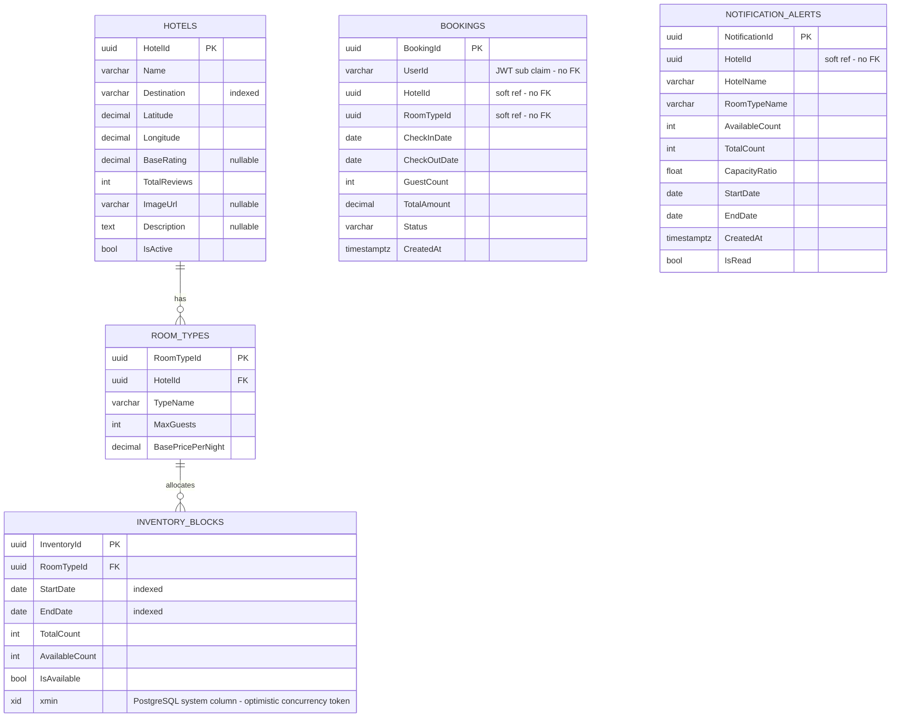

# Hotel Booking System

**SE 4458 — Software Architecture & Design of Modern Large Scale Systems — Final Project (May 2026)**
**Group 1**

A production-grade, Hotels.com-like hotel booking platform built as a cloud-native microservices system on C# .NET Core 8. The system covers the full booking lifecycle: hotel inventory management, availability search with Redis caching, optimistic-concurrency-safe room booking, AI-powered conversational search, per-category hotel reviews in MongoDB, and an asynchronous notification pipeline over RabbitMQ.

---

## Table of Contents

1. [Deliverable Links](#1-deliverable-links)
2. [Demo Video](#2-demo-video)
3. [Technology Stack](#3-technology-stack)
4. [API Reference](#4-api-reference)
5. [Services Overview](#5-services-overview)
6. [Cloud Infrastructure & Deployment Map](#6-cloud-infrastructure--deployment-map)
7. [Architecture](#7-architecture)
8. [Architectural Decisions & Design Patterns](#8-architectural-decisions--design-patterns)
9. [Database Design](#9-database-design)
10. [Project Requirements & Assumptions](#10-project-requirements--assumptions)
11. [Issues Encountered & Engineering Solutions](#11-issues-encountered--engineering-solutions)
12. [Running Locally](#12-running-locally)
13. [Repository Structure](#13-repository-structure)
14. [Team](#14-team)

---

## 1. Deliverable Links

| Resource | URL |
|---|---|
| **Frontend (Vercel)** | https://hotel-booking-system-henna.vercel.app |
| **API Gateway** | https://hotel-gateway-axhpduheewacbvhc.italynorth-01.azurewebsites.net |
| **Gateway Swagger** | https://hotel-gateway-axhpduheewacbvhc.italynorth-01.azurewebsites.net/swagger |
| **Hotel Service** | https://hotel-hotelservice-aje8f7f7dqb5f0a5.italynorth-01.azurewebsites.net |
| **Hotel Service Swagger** | https://hotel-hotelservice-aje8f7f7dqb5f0a5.italynorth-01.azurewebsites.net/swagger |
| **Comments Service** | https://hotel-comments-c9ejhwftbch5eqey.italynorth-01.azurewebsites.net |
| **Comments Service Swagger** | https://hotel-comments-c9ejhwftbch5eqey.italynorth-01.azurewebsites.net/swagger |
| **AI Agent Service** | https://hotel-aiagent-g2avhjfcfyhqcsfd.italynorth-01.azurewebsites.net |
| **AI Agent Swagger** | https://hotel-aiagent-g2avhjfcfyhqcsfd.italynorth-01.azurewebsites.net/swagger |
| **Notification Service** | https://hotel-notification-eccyh5cpdxhpg9b2.italynorth-01.azurewebsites.net |
| **Notification Swagger** | https://hotel-notification-eccyh5cpdxhpg9b2.italynorth-01.azurewebsites.net/swagger |
| **GitHub Repository** | https://github.com/batusalcan/HotelBookingSystem |

All backend services are deployed to **Azure App Service Linux (Italy North, B1 plan)**. The frontend is deployed to **Vercel**.

---

## 2. Demo Video

> **[Video link — to be added]**

---

## 3. Technology Stack

| Concern | Technology | Notes |
|---|---|---|
| **Backend** | C# .NET Core 8 Web API | All 5 microservices |
| **API Gateway** | Ocelot + MMLib.SwaggerForOcelot | Single entry point; JWT validation + rate limiting |
| **Auth / IAM** | Supabase Auth (JWT Bearer, OIDC, RS256) | No local auth — IAM-only per spec |
| **SQL Database** | Supabase PostgreSQL (Npgsql) | Session pooler for IPv4 routing |
| **NoSQL Database** | MongoDB Atlas | Comments Service only |
| **Distributed Cache** | Upstash Redis | Search results (15 min TTL) + hotel detail (60 min TTL) |
| **Message Broker** | CloudAMQP RabbitMQ (SSL, port 5671) | `hotel.reservations` exchange, `reservation.created` queue |
| **Nightly Scheduler** | Azure Logic App | Triggers `POST /api/v1/notifications/capacity-check` nightly |
| **AI Model** | Google Gemini 1.5 Flash | Via `IAiProvider` abstraction; swappable without business logic changes |
| **ORM** | EF Core 8 Code-First | Separate `DbContext` per bounded context; EF Core migrations |
| **Logging** | Serilog + Correlation ID enrichment | Distributed tracing across services |
| **Testing** | xUnit | Unit tests on business logic; 4 test projects |
| **CI/CD** | GitHub Actions | Build → test → Docker build verify on every push to `main` |
| **Containerization** | Docker (Dockerfile per service) | Verified in CI; no image file committed |
| **Frontend** | React + Vite | SPA with Supabase Auth SDK + Leaflet map |
| **Frontend Hosting** | Vercel | Auto-deploy on `git push` |
| **Resilience** | Polly | Circuit breakers; 503 on SQL unreachable |

---

## 4. API Reference

All requests from the frontend go through the API Gateway at:
`https://hotel-gateway-axhpduheewacbvhc.italynorth-01.azurewebsites.net/gateway/v1/`

### Hotel Service Routes

| Method | Gateway Path | Downstream | Auth | Description |
|---|---|---|---|---|
| `GET` | `/gateway/v1/search/hotels` | HotelService | Public | Search hotels by destination, dates, guest count. Returns paginated results with lat/lng for map. Rate-limited: 100 req/min. |
| `GET` | `/gateway/v1/hotels/{everything}` | HotelService | Public | Hotel detail + room types + room detail with xmin token |
| `GET` | `/gateway/v1/bookings` | HotelService | Bearer JWT | Get all bookings for the authenticated user |
| `POST` | `/gateway/v1/bookings` | HotelService | Bearer JWT | Create a booking (requires `rowVersion` for optimistic concurrency) |
| `DELETE` | `/gateway/v1/bookings/{bookingId}` | HotelService | Bearer JWT | Cancel a booking |
| `GET` | `/gateway/v1/admin/hotels` | HotelService | Bearer JWT (Admin) | List all hotels (admin view) |
| `POST` | `/gateway/v1/admin/hotels` | HotelService | Bearer JWT (Admin) | Create a new hotel |
| `GET/PUT/DELETE` | `/gateway/v1/admin/hotels/{everything}` | HotelService | Bearer JWT (Admin) | Update hotel, manage room types, delete hotel |
| `POST` | `/gateway/v1/admin/inventory` | HotelService | Bearer JWT (Admin) | Upsert inventory block (start/end date, room count, availability flag) |

### Comments Service Routes

| Method | Gateway Path | Downstream | Auth | Description |
|---|---|---|---|---|
| `GET` | `/gateway/v1/comments/{hotelId}` | CommentsService | Public | Get paginated comments + category score breakdown |
| `POST` | `/gateway/v1/comments/{hotelId}` | CommentsService | Bearer JWT | Submit a review (authenticated assumption — see §10) |

### Notification Service Routes

| Method | Gateway Path | Downstream | Auth | Description |
|---|---|---|---|---|
| `GET` | `/gateway/v1/notifications` | NotificationService | Bearer JWT (Admin) | Get all low-capacity alerts (paginated) |
| `PATCH` | `/gateway/v1/notifications/{id}/read` | NotificationService | Bearer JWT | Mark an alert as read |
| `POST` | `/gateway/v1/notifications/capacity-check` | NotificationService | None | Nightly cron trigger (called by Azure Logic App) |

### AI Agent Service Routes

| Method | Gateway Path | Downstream | Auth | Description |
|---|---|---|---|---|
| `POST` | `/gateway/v1/ai/chat` | AiAgentService | Bearer JWT | Stateless conversational search & booking. Rate-limited: 30 req/min. |

### Request / Response Examples

**Search Hotels**
```
GET /gateway/v1/search/hotels?destination=Bodrum&startDate=2026-06-01&endDate=2026-06-05&guestCount=2&page=1&pageSize=10
```
```json
[
  {
    "hotelId": "3fa85f64-...",
    "name": "Hyde Bodrum",
    "destination": "Bodrum",
    "latitude": 37.034,
    "longitude": 27.43,
    "pricePerNight": 9305.8,
    "availableRooms": 10,
    "rating": 9.6,
    "totalReviews": 163,
    "roomTypeId": "room-type-uuid"
  }
]
```
> Authenticated users receive a 15% discounted `pricePerNight`. Base prices are cached in Redis; discount is applied at response time and never stored.

**Create Booking**
```
POST /gateway/v1/bookings
Authorization: Bearer <jwt>
```
```json
{
  "hotelId": "3fa85f64-...",
  "roomTypeId": "room-type-uuid",
  "checkInDate": "2026-06-01",
  "checkOutDate": "2026-06-05",
  "guestCount": 2,
  "rowVersion": 1234567
}
```
> Returns `409 Conflict` if `rowVersion` is stale (another user booked the same slot concurrently).

**AI Chat**
```
POST /gateway/v1/ai/chat
Authorization: Bearer <jwt>
```
```json
{
  "message": "I'd like to book a hotel in Bodrum from June 1 to June 5 for 2 adults.",
  "messages": [...],
  "contextState": {}
}
```

---

## 5. Services Overview

### HotelService
The largest service — owns three functional areas (one codebase, one deployment):
- **Admin** — authenticated CRUD for hotels, room types, and inventory blocks. Invalidates Redis cache on inventory update.
- **Search** — public endpoint with cache-aside pattern (Redis → SQL fallback). Returns coordinates for map. Applies 15% discount at response time for JWT holders.
- **Booking** — authenticated booking with optimistic concurrency via PostgreSQL `xmin`. Publishes `ReservationCreatedEvent` to RabbitMQ on success. Supports viewing and cancelling bookings.

**DbContexts:** `CatalogDbContext` (Hotels, RoomTypes, InventoryBlocks) + `BookingDbContext` (Bookings) — both on Supabase PostgreSQL, separate EF Core migrations.

### CommentsService
Stores hotel reviews in MongoDB Atlas. One document per hotel contains all reviews and pre-aggregated category scores (cleanliness, staff, facilities, location, eco-friendliness). GET is public; POST requires Bearer JWT.

### NotificationService
Two responsibilities in one deployment:
1. **Always-on RabbitMQ consumer** — `IHostedService` subscribes to `reservation.created` queue. ACK on success; NACK+requeue on failure. Logs reservation details to console (simulated notification).
2. **Nightly cron endpoint** — `POST /api/v1/notifications/capacity-check` called by Azure Logic App. Queries HotelService's API for inventory blocks below 20% capacity in the next 30 days. Clears and repopulates `NotificationAlerts` table in Supabase PostgreSQL (owns its own `NotificationsDbContext`).

### AiAgentService
Stateless Gemini 1.5 Flash–powered conversational agent. Implements a two-step booking flow: parse intent → clarify if needed → present hotel options → confirm → book. The `IAiProvider` interface decouples business logic from the Gemini SDK — switching to OpenAI/Claude/Azure OpenAI requires only a new class + DI swap.

### ApiGateway (Ocelot)
Single entry point for all frontend traffic. Responsibilities:
- **Routing** — 14 routes forwarding to 4 downstream services
- **JWT Authentication** — validates Supabase-issued Bearer tokens on protected routes before forwarding
- **Rate limiting** — 100 req/min on search, 30 req/min on AI chat
- **Swagger aggregation** — MMLib.SwaggerForOcelot aggregates Swagger from all downstream services

---

## 6. Cloud Infrastructure & Deployment Map

```
┌─────────────────────────────────────────────────────────────────────┐
│                        Azure Italy North                            │
│                                                                     │
│  ┌──────────────┐    ┌────────────────────────────────────────┐     │
│  │   Vercel     │    │         Azure App Services (B1)        │     │
│  │  (Frontend)  │    │                                        │     │
│  │  React+Vite  │───▶│  Ocelot API Gateway                   │     │
│  └──────────────┘    │  hotel-gateway-axhpduheewacbvhc        │     │
│                      │                │                        │     │
│                      │    ┌───────────┼───────────────┐        │     │
│                      │    ▼           ▼               ▼        │     │
│                      │  HotelSvc  CommentsS      AiAgentSvc   │     │
│                      │  NotifySvc                              │     │
│                      └────────────────────────────────────────┘     │
│                                                                     │
│  ┌──────────────────────────────────────────────────────────────┐   │
│  │                      Data Layer                               │   │
│  │  Supabase PostgreSQL  │  MongoDB Atlas  │  Upstash Redis      │   │
│  │  (HotelSvc + NotifySvc│  (CommentsService│  (hotel search +   │   │
│  │   CatalogDb+BookingDb │   hotelReviews  │   hotel detail)    │   │
│  │   NotificationAlerts) │   collection)   │                    │   │
│  └──────────────────────────────────────────────────────────────┘   │
│                                                                     │
│  ┌─────────────────────────────────────────────────────────────┐    │
│  │                  Async & Scheduling                          │    │
│  │  CloudAMQP RabbitMQ (SSL)  │  Azure Logic App (nightly)     │    │
│  │  hotel.reservations exch.  │  → POST /notifications/        │    │
│  │  reservation.created queue │     capacity-check             │    │
│  └─────────────────────────────────────────────────────────────┘    │
│                                                                     │
│  ┌───────────────────────┐    ┌────────────────┐                    │
│  │  Supabase Auth (IAM)  │    │  Google Gemini │                    │
│  │  JWT issuer (RS256)   │    │  1.5 Flash API │                    │
│  └───────────────────────┘    └────────────────┘                    │
└─────────────────────────────────────────────────────────────────────┘
```

**Deployment procedure:** Services are deployed manually via Kudu's `/api/zipdeploy` REST API (not `az webapp deploy` — see §11). CI/CD builds and tests on every push but does **not** auto-deploy to Azure. Frontend auto-deploys to Vercel on every `git push`.

---

## 7. Architecture

### High-Level Request Flow

```
Browser / Mobile
       │
       │ HTTPS
       ▼
  ┌─────────────────────────┐
  │   API Gateway (Ocelot)  │  ← JWT validation, rate limiting, routing
  └────────────┬────────────┘
               │
    ┌──────────┼──────────────────┐
    │          │                  │
    ▼          ▼                  ▼
HotelService  CommentsService  AiAgentService
  │  │  │       (MongoDB)       (Gemini API)
  │  │  │
  │  │  └── BookingDbContext (Bookings table)
  │  └───── CatalogDbContext (Hotels, RoomTypes, InventoryBlocks)
  │         + Redis cache-aside
  │
  │  on booking success
  └──[AMQP publish]──▶ RabbitMQ ──▶ NotificationService
                                        │
                                        ├── Log reservation (always-on consumer)
                                        └── NotificationsDbContext (NotificationAlerts table)
                                               ↑
                                         Azure Logic App (nightly trigger)
```

### Microservice Boundaries

Each service is independently deployed, independently versioned, and owns its own data store. Services never share a `DbContext`, never query another service's database, and never use hard SQL FK constraints across service boundaries. Cross-service data references are soft references (plain GUIDs).

### Two-Layer Authentication

```
Request → API Gateway
            │
            ├── [AuthenticationOptions: Bearer] validates JWT signature (Supabase JWKS)
            │   → Rejects with 401 if token is invalid or missing on protected routes
            │
            └── Forwards request + original Authorization header downstream
                        │
                        ▼
               HotelService / NotificationService
                        │
                        └── IsAdmin(): decodes app_metadata.roles from JWT
                            → Rejects with 403 if role ≠ admin
```

The gateway handles **authentication** (is the token valid?). Downstream services handle **authorization** (is the user allowed to do this?). Ocelot forwards the `Authorization` header unchanged — it does not strip it after validation.

---

## 8. Architectural Decisions & Design Patterns

### Design Patterns

| Pattern | Service | Implementation | Why |
|---|---|---|---|
| **Cache-Aside** | HotelService | `SearchService.cs` checks Redis → SQL on miss → repopulates Redis | Search must return < 500ms; Redis makes this possible without hitting Supabase on every request |
| **Optimistic Concurrency** | HotelService | PostgreSQL `xmin` system column as EF Core concurrency token; `DbUpdateConcurrencyException` → HTTP 409 | Prevents overbooking without pessimistic row locking |
| **Strategy** | HotelService | `IPricingStrategy` → `DiscountPricingStrategy` (15% for JWT holders) vs `BasePricingStrategy` | Swappable pricing tiers without modifying core booking logic |
| **Singleton** | All services | `IConnectionMultiplexer` (Redis), `IConnection` (RabbitMQ) registered as singletons | One connection pool per service instance; prevents connection exhaustion |
| **Factory Method** | NotificationService | `INotificationFactory` creates `BookingNotification` vs `LowCapacityNotification` | Decouples alert creation from the consumer/scheduler decision logic |
| **Facade** | AiAgentService | `HotelServiceClient` wraps all internal REST calls to HotelService | AI business logic never knows it's calling a remote service |
| **Provider Abstraction** | AiAgentService | `IAiProvider` interface → `GeminiAiProvider` | Switching AI models requires only a new class + DI swap; zero business logic changes |
| **Database-per-Service** | All services | Separate EF Core `DbContext` per bounded context; no shared DB | Core microservices principle; enables independent scaling and deployment |
| **Event-Driven (Pub/Sub)** | HotelService → NotificationService | `ReservationCreatedEvent` published to RabbitMQ on booking success | Decouples booking from notification delivery; notification failures cannot roll back bookings |

### Key Architectural Decisions

**1. Single HotelService (Admin + Search + Booking merged)**
The project spec's deployment diagram shows one "Hotel Service" box responsible for all hotel operations. These three functional areas share the same Supabase schema (Hotels, RoomTypes, InventoryBlocks, Bookings), making a single deployment more practical. Internal separation is maintained via separate DbContexts and service classes.

**2. Supabase PostgreSQL instead of Azure SQL Server**
Supabase provides managed PostgreSQL with built-in Auth (JWT/OIDC) in one platform. This eliminated a separate identity service. The session pooler endpoint (`aws-1-eu-central-1.pooler.supabase.com`) is used to route over IPv4, avoiding direct connection IPv6 failures in cloud environments.

**3. PostgreSQL `xmin` instead of SQL Server `ROWVERSION`**
Since the project uses PostgreSQL instead of the spec's assumed SQL Server, EF Core's `IsRowVersion()` (which maps to `ROWVERSION`/`timestamp`) is not available. The equivalent is PostgreSQL's built-in `xmin` system column, configured as a shadow EF Core concurrency token via `UseXminAsConcurrencyToken()`.

**4. Never Cache Discounted Prices**
Redis stores base prices only. The 15% discount is computed at response time based on JWT presence. This prevents a discounted price being served to an unauthenticated user on a cache hit, and makes the discount policy independently changeable without cache invalidation.

**5. Cache Key Versioning (`v2:` prefix)**
When a data structure fix was deployed (duplicate hotel deduplication), existing cached entries had an incompatible structure. Rather than flushing all Redis keys manually, a `v2:` prefix was added to the search cache key pattern. This instantly invalidated all old entries by making them unreachable, with zero downtime.

**6. `NotificationsDbContext` with Raw SQL Table Creation**
EF Core's `EnsureCreated()` silently skips table creation when the target database already has any tables. Since Supabase PostgreSQL is shared across services (multiple tables already exist), `EnsureCreated()` would never create the `NotificationAlerts` table. Solution: raw `CREATE TABLE IF NOT EXISTS` SQL on service startup wrapped in a try-catch, making the service self-initializing on first deploy.

---

## 9. Database Design

### Storage Architecture

| Context | Technology | Service | Tables / Collections |
|---|---|---|---|
| `CatalogDbContext` | Supabase PostgreSQL | HotelService | `Hotels`, `RoomTypes`, `InventoryBlocks` |
| `BookingDbContext` | Supabase PostgreSQL | HotelService | `Bookings` |
| `NotificationsDbContext` | Supabase PostgreSQL | NotificationService | `NotificationAlerts` |
| `CommentsDbContext` | MongoDB Atlas | CommentsService | `hotelReviews` collection |
| Redis | Upstash Redis | HotelService | Search results cache, hotel detail cache |

### ER Diagram



### Redis Cache Schema

| Key Pattern | TTL | Value | Notes |
|---|---|---|---|
| `v2:search:{destination}:{startDate}:{endDate}:{guestCount}` | 15 min | JSON array of hotel results | Base prices only. `v2:` prefix busts pre-fix cache entries. |
| `hotel:detail:{hotelId}` | 60 min | JSON hotel detail object | Explicitly evicted on admin inventory update. |

### MongoDB Document Schema (`hotelReviews`)

```json
{
  "hotelId": "3fa85f64-...",
  "totalReviews": 163,
  "overallScore": 9.2,
  "categoryScores": {
    "cleanliness": 9.6,
    "staff": 9.6,
    "facilities": 9.4,
    "locationCondition": 9.6,
    "ecoFriendly": 9.4
  },
  "reviews": [
    {
      "reviewId": "rev-uuid-001",
      "author": "Simge",
      "tripType": "4 gecelik seyahat",
      "rating": 8.0,
      "text": "Great location and very clean.",
      "date": "2025-06-16T00:00:00Z",
      "hotelReply": {
        "repliedBy": "Enver",
        "replyText": "Geri bildiriminiz için teşekkür ederiz.",
        "replyDate": "2025-06-16T00:00:00Z"
      }
    }
  ]
}
```

### Optimistic Concurrency — How It Works

```
1. GET /hotels/{id}/rooms/{roomTypeId}
   → Server returns room detail + xmin value (PostgreSQL transaction ID)
   → Client stores xmin as rowVersion

2. POST /bookings  { ..., rowVersion: <xmin> }
   → EF Core executes:
     UPDATE "InventoryBlocks"
     SET "AvailableCount" = "AvailableCount" - 1
     WHERE "InventoryId" = @id
       AND xmin = @rowVersion      ← fails if another user booked first
       AND "AvailableCount" > 0

3a. 1 row affected → booking confirmed → 201 Created
3b. 0 rows affected → DbUpdateConcurrencyException → 409 Conflict (try again)
```

### Data Seeding

The system ships with seed data for meaningful end-to-end testing:
- **8 hotels** across Istanbul (×2), Izmir (×1), Bodrum (×2), Antalya (×3) — all with valid lat/lng for the map feature
- **2–3 room types** per hotel (Standard, Family, Suite variants)
- **3 inventory blocks** per room type covering the next 90 days, with at least one block at < 20% capacity to trigger the nightly alert

---

## 10. Project Requirements & Assumptions

### Requirements Checklist

| Requirement | Status | Notes |
|---|---|---|
| Hotel Admin Service (auth-gated) | ✅ | CRUD hotels, room types, inventory — JWT + IsAdmin() check |
| Hotel Search (destination/dates/guests) | ✅ | Cached, paginated, returns lat/lng |
| "Haritada göster" map | ✅ | Leaflet/OpenStreetMap toggle on search results |
| 15% discount for logged-in users | ✅ | Strategy pattern; never cached |
| Book Hotel (capacity decrement, no payment) | ✅ | Optimistic concurrency; 409 on overbooking |
| Hotel Comments (category graph + paginated) | ✅ | MongoDB, 5 category scores, paginated |
| Notification — nightly capacity check (<20%) | ✅ | Azure Logic App → capacity-check endpoint → NotificationAlerts |
| Notification — RabbitMQ reservation events | ✅ | Always-on IHostedService consumer |
| AI Agent (conversational search + booking) | ✅ | Gemini 1.5 Flash; two-step confirm flow |
| API Gateway (all APIs via gateway) | ✅ | Ocelot; 14 routes |
| IAM (no local auth) | ✅ | Supabase Auth only |
| Redis distributed cache | ✅ | Upstash Redis |
| NoSQL for comments | ✅ | MongoDB Atlas |
| Dockerfiles (no image file) | ✅ | One per service (6 total including frontend) |
| Separate deployments (5 services) | ✅ | Azure App Service Linux, Italy North |
| REST versioning (`/v1/`) | ✅ | All routes prefixed |
| Pagination | ✅ | Search, comments, notifications |
| Health endpoints | ✅ | `/health` on all services |
| Swagger per service | ✅ | Individual + aggregated on gateway |
| xUnit tests | ✅ | HotelService, CommentsService, NotificationService, AiAgentService |
| Serilog + Correlation IDs | ✅ | Distributed tracing |
| GitHub Actions CI | ✅ | Build + test + docker build verify |
| README with deployed URLs, ER, assumptions, issues, video | ✅ | This document |

### Assumptions

**Assumption 1 — Booking requires JWT authentication**

> The project document specifies that logged-in users will receive a 15% discount, implying that hotel search should be accessible to unauthenticated users. Therefore, searching for hotels is open to the public. However, since the system does not require a payment transaction, the "Book Hotel" operation has been restricted exclusively to authenticated users via the IAM service (Supabase Auth). This architectural decision was made to prevent malicious/spam reservations, ensure that hotel capacities are safely and accurately reduced, and properly track the reservation owner via the JWT `sub` claim.

**Assumption 2 — POST /comments requires JWT authentication**

The project spec only shows the comments display UI. A `POST /api/v1/comments/{hotelId}` endpoint was added because:
1. Without it, the NoSQL database can only contain static seeded data — there is no mechanism for users to submit reviews dynamically.
2. The PDF mockup shows "verified" labels and stay-duration metadata (e.g., "4 gecelik seyahat") on reviews, implying only authenticated, verified guests can post comments. The endpoint validates the Bearer JWT before accepting any submission.

**Assumption 3 — RabbitMQ consumer is always-on, not nightly batch**

The project PDF groups both notification tasks under "write a nightly scheduled task", which could imply a nightly batch pull from the queue. The queue consumer is implemented as an **always-on `IHostedService`** (ACK/NACK per message) rather than a nightly batch job. A batch-pull pattern would leave booking confirmation messages undelivered for up to 24 hours — contradicting the real-time notification intent of a message queue.

**Assumption 4 — Notification alerts are in-website, not email/SMS**

Low-capacity alerts are delivered as in-website notifications stored in the `NotificationAlerts` table. This provides a persistent, queryable audit trail the admin panel can display in real time with a 60-second refresh cycle. Email/SMS integration would require a third-party service (SendGrid, Twilio) and was not specified in the project definition.

**Assumption 5 — Sign-Up page is implemented**

The project mockups do not show a self-registration screen. A Sign-Up page was implemented to make the 15% member discount flow fully demonstrable end-to-end. Without self-registration, a test evaluator cannot obtain a JWT and the discount path cannot be exercised during the demo. Account creation goes directly to Supabase Auth — no custom auth code exists in the backend.

**Assumption 6 — Admin and user client are a single React app**

The project diagram shows a separate "Admin Client" and "Client". In the implementation, both are a single React SPA with role-based routing: users with `app_metadata.roles = admin` see the Admin panel; regular users see search/booking/comments. This simplifies deployment without reducing functionality.

**Assumption 7 — Two-layer auth model (Gateway + Service)**

The API Gateway validates JWT authenticity (authentication — is the token valid and unexpired?). HotelService's `IsAdmin()` checks `app_metadata.roles` in the forwarded JWT (authorization — is the user an admin?). Both layers are active on admin routes. Ocelot forwards the `Authorization: Bearer` header to downstream services unchanged — it does not strip it after gateway-level validation.

**Assumption 8 — Notification search vs. capacity alert apparent contradiction**

The search page may show 10 available rooms for a hotel while the Notifications panel shows the same hotel as low-capacity. This is correct, not a bug. The seed data creates 3 inventory blocks per room type:
- Block 1 (near-term): 10 rooms available → what search hits for current dates
- Block 2 (mid-term, June): 1 of 10 rooms available → 10% capacity → triggers the < 20% alert
- Block 3 (summer): 8 of 10 rooms available

The nightly scheduler looks 30 days ahead for **any** block below 20%. A hotel can be fully available today but nearly full for a future period. The alert card shows the specific date range at risk.

---

## 11. Issues Encountered & Engineering Solutions

### 1. Supabase Direct Connection — IPv6 Routing Failure

**Symptom:** The Supabase direct connection URL (`db.xxx.supabase.co:5432`) fails in GitHub Actions CI and on macOS with "No route to host."

**Root cause:** Supabase's direct connection endpoint resolves to an IPv6 address. GitHub Actions runners and some macOS networking paths cannot route to IPv6 hosts.

**Fix:** Use Supabase's session pooler endpoint (`aws-1-eu-central-1.pooler.supabase.com:5432?sslmode=require`), which routes over IPv4 and also provides connection pooling.

---

### 2. Redis `SyncTimeout` Blocking CI for 5 Seconds

**Symptom:** CI pipeline health checks block for 5 full seconds when Redis is unreachable (no credentials configured in CI).

**Root cause:** `StackExchange.Redis` defaults to `ConnectTimeout = 5000ms` and `SyncTimeout = 5000ms`. A `PingAsync()` call on a disconnected multiplexer waits the full timeout.

**Fix:** Set `ConnectTimeout = 1000, SyncTimeout = 2000` in the Redis connection string configuration, reducing the worst-case CI block from 5s to 2s.

---

### 3. MongoDB `ServerSelectionTimeout` Blocking CI for 30 Seconds

**Symptom:** Comments Service health check hangs for 30 seconds in CI before failing.

**Root cause:** MongoDB driver's default `ServerSelectionTimeout` is 30 seconds. Without Atlas credentials in CI, every connection attempt waits the full 30s.

**Fix:** Set `ServerSelectionTimeout = TimeSpan.FromSeconds(3)` in `MongoClientSettings` on startup.

---

### 4. CloudAMQP RabbitMQ — VirtualHost + SSL Required

**Symptom:** RabbitMQ connection refused on default port 5672.

**Root cause:** CloudAMQP uses a custom virtual host (matches username) and requires SSL on port 5671. The default `ConnectionFactory` with no SSL settings is rejected.

**Fix:** Explicitly set `VirtualHost`, `Port = 5671`, and `SslOption { Enabled = true, ServerName = host }` in all three usages (Publisher, Consumer, HealthCheck).

---

### 5. Azure Student Subscription — West Europe Region Blocked

**Symptom:** App Service deployment to West Europe fails for the student subscription.

**Root cause:** Azure student subscriptions have region restrictions.

**Fix:** All 5 services deployed to Italy North (`italynorth-01.azurewebsites.net`).

---

### 6. `az webapp deploy --type zip` Returns HTTP 400

**Symptom:** Standard Azure CLI deploy command fails with ResourceNotFound or 400.

**Root cause:** `az webapp deploy` uses the `management.azure.com` token scope internally. Kudu's `/api/zipdeploy` endpoint requires the `management.core.windows.net` scope. Token scope mismatch causes 400.

**Fix:** Use Kudu's REST API directly with the correct token:
```bash
TOKEN=$(az account get-access-token --resource "https://management.core.windows.net/" --query accessToken -o tsv)
curl -X POST -H "Authorization: Bearer $TOKEN" -H "Content-Type: application/zip" \
  --data-binary @app.zip \
  "https://<scm-host>/api/zipdeploy?isAsync=true"
```

---

### 7. Kudu "Extract zip" Error — Native Linux Launcher in Zip

**Symptom:** Deployment status fails; logs show "Extract zip" error.

**Root cause:** `dotnet publish -c Release` on macOS (Apple Silicon) produces a native macOS ARM64 launcher binary with no file extension (e.g., `HotelService`, `ApiGateway`). Kudu's Linux zip extractor rejects zips containing a file matching the project name with no extension.

**Fix:** Always exclude the launcher when building the deployment zip:
```python
skip = {'HotelService'}  # {'ApiGateway'} for the gateway, etc.
with zipfile.ZipFile(out, 'w', zipfile.ZIP_DEFLATED) as z:
    [z.write(os.path.join(src, f), f) for f in os.listdir(src) if f not in skip]
```

---

### 8. Silent Deploy Failure Masked by Shell Pipe

**Symptom:** Deploy commands appear to succeed (exit 0) but the app is never updated.

**Root cause:** Commands piped through `| tail -5` make the shell expression's exit code equal to `tail`'s (always 0), masking the real failure from the deploy command.

**Fix:** Capture the deploy command's output separately before piping, or check the Kudu async deployment status via the `Location` header from the 202 response.

---

### 9. `ASPNETCORE_ENVIRONMENT` Not Set — Wrong Config Loaded

**Symptom:** App starts but all connections fail; logs show placeholder values.

**Root cause:** `appsettings.json` (committed to git) has placeholder connection strings. Real credentials are in `appsettings.Development.json` (gitignored). Without `ASPNETCORE_ENVIRONMENT=Development` in Azure App Settings, only the placeholder file loads.

**Fix:**
```bash
az webapp config appsettings set --name <app> --resource-group hotel-booking-rg \
  --settings ASPNETCORE_ENVIRONMENT=Development
```

---

### 10. Startup Command Mismatch — Deploy Succeeds But App Runs Old Code

**Symptom:** Deploy shows status 4 (success), new DLL is verified on disk in `/home/site/wwwroot/`, but Swagger doesn't show new routes and old behavior persists.

**Root cause:** The app was originally deployed via a mechanism that placed files in `/home/site/wwwroot/HotelService/` (a subdirectory). The App Service startup command was set to `dotnet /home/site/wwwroot/HotelService/HotelService.dll`. All subsequent Kudu zip deploys write to `/home/site/wwwroot/` directly — a different path. The running process loaded the old subdirectory DLL, which was never updated.

**Discovery:** Read the startup command via `az webapp config show ... --query appCommandLine`. Verified the running DLL path via Kudu's command API. Compared `md5sum` of the file the process was loading vs. the newly deployed one.

**Real-world impact:** The gateway's old `ocelot.json` was missing the `DELETE` method on admin hotel routes. Hotel deletes from the frontend reached the gateway, which silently dropped them (no matching Ocelot route → no forwarding). Frontend received no error. Only discovered by reading the running `ocelot.json` from the subdirectory via Kudu command API.

**Fix (one-time, applied to HotelService and ApiGateway):**
```bash
az webapp config set --name hotel-hotelservice --resource-group hotel-booking-rg \
  --startup-file "dotnet /home/site/wwwroot/HotelService.dll"
az webapp config set --name hotel-gateway --resource-group hotel-booking-rg \
  --startup-file "dotnet /home/site/wwwroot/ApiGateway.dll"
```

---

### 11. ApiGateway csproj — Duplicate `Content` Item Build Error

**Symptom:** `dotnet publish` fails with `NETSDK1022: Duplicate 'Content' items were included` for `ocelot.json`.

**Root cause:** The SDK includes `ocelot.json` implicitly as a `Content` item. An explicit `<Content Include="ocelot.json">` in the `.csproj` file created a duplicate.

**Fix:** Changed `<Content Include="ocelot.json">` to `<Content Update="ocelot.json">` to override the implicit entry without duplicating it.

---

### 12. `EnsureCreated()` Silently Skips Table Creation

**Symptom:** `NotificationAlerts` table never gets created; Notification Service crashes on first query with "relation does not exist."

**Root cause:** EF Core's `EnsureCreated()` skips all table creation if the target database has any tables already. The shared Supabase database has many tables from HotelService migrations, so `EnsureCreated()` does nothing.

**Fix:** Raw SQL on startup:
```sql
CREATE TABLE IF NOT EXISTS "NotificationAlerts" (
  "NotificationId" UUID PRIMARY KEY DEFAULT gen_random_uuid(),
  ...
);
```
Wrapped in a try-catch so startup failures are logged but don't crash the service.

---

## 12. Running Locally

### Prerequisites

- [.NET 8 SDK](https://dotnet.microsoft.com/download/dotnet/8)
- [Node.js 20+](https://nodejs.org/)
- Access to: Supabase project, MongoDB Atlas cluster, Redis instance, CloudAMQP RabbitMQ, Gemini API key, Supabase Auth

### Environment Setup

Each backend service reads secrets from `appsettings.Development.json` (gitignored). Copy `appsettings.json` as a starting point:

```bash
# Example: HotelService
cp backend/HotelService/appsettings.json backend/HotelService/appsettings.Development.json
```

Fill in the following in each service's `appsettings.Development.json`:

| Service | Keys Required |
|---|---|
| HotelService | `ConnectionStrings:CatalogDb`, `ConnectionStrings:BookingDb`, `Redis:ConnectionString`, `Jwt:Authority`, `Jwt:Audience`, `RabbitMQ:*` |
| CommentsService | `MongoDb:ConnectionString`, `MongoDb:DatabaseName`, `Jwt:Authority`, `Jwt:Audience` |
| NotificationService | `ConnectionStrings:NotificationsDb`, `RabbitMQ:*`, `HotelServiceUrl` |
| AiAgentService | `AI:ApiKey`, `AI:ModelName`, `HotelServiceUrl`, `Jwt:Authority`, `Jwt:Audience` |
| ApiGateway | `Jwt:Authority`, `Jwt:Audience` |

### Running Backend Services

Start services in any order (gateway last):

```bash
cd backend/HotelService && dotnet run
cd backend/CommentsService && dotnet run
cd backend/NotificationService && dotnet run
cd backend/AiAgentService && dotnet run
cd backend/ApiGateway && dotnet run
```

Default ports (configurable in `launchSettings.json`):
- HotelService: `http://localhost:5001`
- CommentsService: `http://localhost:5002`
- NotificationService: `http://localhost:5003`
- AiAgentService: `http://localhost:5004`
- ApiGateway: `http://localhost:5158`

For local runs, update `ocelot.json` downstream hosts to `localhost` with the appropriate ports.

### Running the Frontend

```bash
cd frontend
cp .env.example .env
# Edit .env: set VITE_GATEWAY_URL=http://localhost:5158
#            set VITE_SUPABASE_URL and VITE_SUPABASE_ANON_KEY from your Supabase project
npm install
npm run dev
```

Frontend runs at `http://localhost:5173`.

### Running Tests

```bash
# All test projects
dotnet test backend/HotelService.Tests/HotelService.Tests.csproj
dotnet test backend/CommentsService.Tests/CommentsService.Tests.csproj
dotnet test backend/NotificationService.Tests/NotificationService.Tests.csproj
dotnet test backend/AiAgentService.Tests/AiAgentService.Tests.csproj
```

### Building Docker Images Locally

```bash
# From the backend/ directory (shared SharedKernel is in build context)
docker build -f HotelService/Dockerfile . -t hotelbooking/hotelservice
docker build -f ApiGateway/Dockerfile . -t hotelbooking/gateway

# Frontend
docker build -f frontend/Dockerfile frontend/ -t hotelbooking/frontend
```

### Health Checks

All services expose `/health`. A healthy service returns `HTTP 200`:
```bash
curl https://hotel-gateway-axhpduheewacbvhc.italynorth-01.azurewebsites.net/health
curl https://hotel-hotelservice-aje8f7f7dqb5f0a5.italynorth-01.azurewebsites.net/health
```

---

## 13. Repository Structure

```
HotelBookingSystem/
├── backend/
│   ├── SharedKernel/                  # Shared events, DTOs (ReservationCreatedEvent)
│   ├── ApiGateway/                    # Ocelot gateway + ocelot.json route config
│   ├── HotelService/                  # Admin + Search + Booking (CatalogDbContext, BookingDbContext)
│   │   └── Migrations/
│   │       ├── Catalog/               # EF Core migrations for CatalogDbContext
│   │       └── Booking/               # EF Core migrations for BookingDbContext
│   ├── CommentsService/               # MongoDB reviews (CommentsDbContext)
│   ├── NotificationService/           # RabbitMQ consumer + nightly cron (NotificationsDbContext)
│   ├── AiAgentService/                # Gemini AI chat (IAiProvider abstraction)
│   ├── HotelService.Tests/            # xUnit tests for HotelService business logic
│   ├── CommentsService.Tests/
│   ├── NotificationService.Tests/
│   └── AiAgentService.Tests/
├── frontend/
│   └── src/
│       ├── api/hotelApi.js            # All API calls to gateway
│       ├── context/AuthContext.jsx    # Supabase Auth session + JWT management
│       ├── pages/                     # HomePage, SearchResults, HotelDetail, Booking,
│       │                              #   MyBookings, AdminPage, LoginPage, SignUpPage
│       └── components/                # Navbar, HotelCard, MapView, AiChatWidget, CommentSection
├── docs/
│   ├── requirements.md                # Full functional + non-functional requirements
│   ├── business_process_mapping.md    # Business process flows (BP-01 through BP-09)
│   ├── Database-Design-ER-Modeling.md # Full data dictionary and ER documentation
│   └── project-plan.md                # Phase-by-phase implementation plan
├── .github/
│   └── workflows/ci.yml              # GitHub Actions: build → test → docker build verify
└── README.md
```

---

## 14. Team

**Group 1 — SE 4458 — Yaşar University — May 2026**

Batuhan Salcan · Mustafa Berkay Düzenli · Batıkan Akdeniz · Cenk Serbest · Toprak Orman · İlayda Gün · Demir Demirdoğen · Aycan Kurt · Ayfernaz Baygın · Sümeyye Şencan · Begüm Bal · Eren Karcı · Barış Hansu · İdil Balandı · Berk Ateş

---

*Documentation: [docs/](docs/) — Full requirements, business process maps, ER modeling, and phase-by-phase plan*
