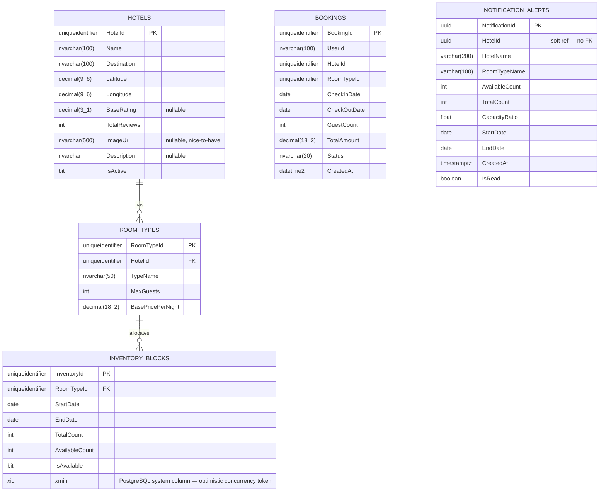

# Phase 3: Database Design & Entity-Relationship (ER) Modeling

This document defines the complete data persistence layer for the Hotel Booking System. Adhering to the **Database-per-Service** microservices pattern, data is logically isolated by bounded context. The system uses three distinct storage technologies, each owned exclusively by the service responsible for it.

---

## 1. Storage Architecture Overview

| Storage Type             | Technology                | Owned By                                | Purpose                                                      |
| :----------------------- | :------------------------ | :-------------------------------------- | :----------------------------------------------------------- |
| **Relational SQL**       | Supabase PostgreSQL (Npgsql) | Hotel Service (`CatalogDbContext`, `BookingDbContext`) | Transactional data: hotel inventory, room types, bookings |
| **Relational SQL**       | Supabase PostgreSQL (Npgsql) | Notification Service (`NotificationsDbContext`) | Persistent low-capacity alert records for the admin notification panel |
| **NoSQL Document Store** | MongoDB / Azure Cosmos DB | Comments Service             | Unstructured review documents and aggregated category scores |
| **Distributed Cache**    | Redis                     | Hotel Service                | Cached hotel search results with TTL for sub-500ms response  |

> **Deployment Note:** The two SQL contexts (`CatalogDbContext` and `BookingDbContext`) are both connected to Supabase PostgreSQL. They can be implemented as separate schemas (e.g., `catalog` and `booking`) within the same Supabase project for cost efficiency, or as physically separate databases. They must **never** share EF Core `DbContext` instances or reference each other with hard FK constraints. Connection strings use the Npgsql format: `Host=xxx.supabase.co;Database=xxx;Username=postgres;Password=xxx`.

---

## 2. Bounded Contexts & Ownership

- **Hotel Catalog & Inventory Context** _(Hotel Service — `CatalogDbContext`)_: Owns `Hotels`, `RoomTypes`, `InventoryBlocks`. Admin endpoints write; search endpoints read (via Redis cache or direct SQL on cache miss).
- **Booking Context** _(Hotel Service — `BookingDbContext`)_: Owns `Bookings`. References `HotelId` and `RoomTypeId` as soft references — no hard FK constraints cross DbContext boundaries even though both live in the same service.
- **Comments Context** _(Comments Service)_: Owns the NoSQL document collection. Completely isolated; communicates no data to SQL services.
- **Notification Alerts Context** _(Notification Service — `NotificationsDbContext`)_: Owns `NotificationAlerts`. Written exclusively by the nightly capacity alert cron job; read by the Admin Panel via `GET /api/v1/notifications`. The table is created on service startup via raw SQL (`CREATE TABLE IF NOT EXISTS`) because EF Core `EnsureCreated()` silently skips table creation when the target Supabase database already has other tables.

---

## 3. Entity-Relationship (ER) Diagram

> Paste the code block below into a Mermaid viewer (e.g., [mermaid.live](https://mermaid.live) or GitHub's native markdown renderer).



---

## 4. Data Dictionary (SQL Schema Specifications)

### Context A: Hotel Catalog & Inventory (`CatalogDbContext`)

---

#### Table: `Hotels`

The master record for hotel properties. Managed by Hotel Service — admin endpoints write; search endpoints read.

| Column Name   | Data Type          | Constraints                    | Description                                                                                                  |
| :------------ | :----------------- | :----------------------------- | :----------------------------------------------------------------------------------------------------------- |
| `HotelId`     | `UNIQUEIDENTIFIER` | Primary Key, Default `NEWID()` | Unique identifier for the hotel.                                                                             |
| `Name`        | `NVARCHAR(100)`    | Not Null                       | Display name, e.g., "Hyde Bodrum - Yetişkin Oteli".                                                          |
| `Destination` | `NVARCHAR(100)`    | Not Null, **Indexed**          | City/region string used for Hotel Service search endpoint destination filtering, e.g., "Bodrum".              |
| `Latitude`    | `DECIMAL(9,6)`     | Not Null                       | Geographic latitude. Required for "Haritada göster" map feature.                                             |
| `Longitude`   | `DECIMAL(9,6)`     | Not Null                       | Geographic longitude. Required for "Haritada göster" map feature.                                            |
| `BaseRating`   | `DECIMAL(3,1)` | Nullable                      | Denormalized aggregated rating from the Comments Service. Nullable since a new hotel may have no reviews. |
| `TotalReviews` | `INT`          | Not Null, Default `0`         | Denormalized total review count from the Comments Service. Required by the search result UI ("3 yorum"). Seeded with realistic values; updated manually or by a batch sync — never queried live from Comments during search (latency constraint). |
| `ImageUrl`     | `NVARCHAR(500)` | **Nullable** (Nice-to-Have)  | URL of the hotel's primary display image. Optional field — the project spec lists image uploading as a nice-to-have. If implemented, the admin `POST /api/v1/admin/hotels` endpoint accepts this field; the image itself is uploaded to an external storage service (e.g., Azure Blob Storage) and the resulting URL stored here. |
| `Description`  | `TEXT`          | **Nullable**                  | Optional freetext description of the hotel, displayed on the hotel detail page. |
| `IsActive`     | `BIT`          | Not Null, Default `1`         | Soft-delete flag. Inactive hotels do not appear in search results.                                       |

**Indexes:**

- `IX_Hotels_Destination` on `Destination` — accelerates the most common Hotel Service search `WHERE` clause.

---

#### Table: `RoomTypes`

Defines the categories of rooms available within a hotel. Managed by Hotel Service (admin endpoints).

| Column Name         | Data Type          | Constraints                               | Description                                                                                                    |
| :------------------ | :----------------- | :---------------------------------------- | :------------------------------------------------------------------------------------------------------------- |
| `RoomTypeId`        | `UNIQUEIDENTIFIER` | Primary Key, Default `NEWID()`            | Unique identifier for the room category.                                                                       |
| `HotelId`           | `UNIQUEIDENTIFIER` | Foreign Key → `Hotels(HotelId)`, Not Null | Links to the owning hotel.                                                                                     |
| `TypeName`          | `NVARCHAR(50)`     | Not Null                                  | Room category name, e.g., "Standard", "Aile" (Family). Matches the "Oda Tipi" dropdown in the Admin UI mockup. |
| `MaxGuests`         | `INT`              | Not Null, Check `>= 1`                    | Maximum occupancy. Used by the Hotel Service search endpoint to filter results against the `GuestCount` query parameter. |
| `BasePricePerNight` | `DECIMAL(18,2)`    | Not Null, Check `> 0`                     | Price before the 15% JWT discount Strategy is applied.                                                         |

---

#### Table: `InventoryBlocks`

Tracks room availability for specific date ranges. This is the most critical table in the system — it is the target of the Optimistic Concurrency check during booking and the source for the nightly capacity alert cron job.

| Column Name      | Data Type                  | Constraints                                     | Description                                                                                                                                                                        |
| :--------------- | :------------------------- | :---------------------------------------------- | :--------------------------------------------------------------------------------------------------------------------------------------------------------------------------------- |
| `InventoryId`    | `UNIQUEIDENTIFIER`         | Primary Key, Default `NEWID()`                  | Unique identifier for the availability block.                                                                                                                                      |
| `RoomTypeId`     | `UNIQUEIDENTIFIER`         | Foreign Key → `RoomTypes(RoomTypeId)`, Not Null | Links to the room category this block applies to.                                                                                                                                  |
| `StartDate`      | `DATE`                     | Not Null, **Indexed**                           | Start of the availability window. Maps to the Admin UI "Başlangıç" field.                                                                                                          |
| `EndDate`        | `DATE`                     | Not Null, **Indexed**                           | End of the availability window. Maps to the Admin UI "Bitiş" field. Must satisfy `StartDate < EndDate`.                                                                            |
| `TotalCount`     | `INT`                      | Not Null, Check `>= 0`                          | Total physical rooms of this type for this date range. **Set once on creation** to the value of `AvailableCount` from the admin's "Oda Adedi" input; never modified after that. Exists solely to support the nightly cron ratio: `AvailableCount / TotalCount < 0.20`. |
| `AvailableCount` | `INT`                      | Not Null, Check `>= 0`                          | Currently available rooms. On creation equals `TotalCount`. Decremented atomically during a booking transaction.                                                                   |
| `IsAvailable`    | `BIT`                      | Not Null, Default `1`                           | Admin-set availability flag. Maps to the "Dolu / Boş" radio button in the Admin UI mockup. Only blocks with `IsAvailable = 1` and `AvailableCount > 0` appear in Search results.   |
| `xmin`           | `xid` (uint)               | System column, ConcurrencyToken                 | PostgreSQL's built-in transaction ID system column. Auto-incremented by PostgreSQL on every row update. Used by EF Core/Npgsql for Optimistic Concurrency via `UseXminAsConcurrencyToken()`. The client receives the current xmin value as a `uint` from `GET /api/v1/hotels/{hotelId}/rooms/{roomTypeId}` and must send it back in `POST /api/v1/bookings`. Not stored as a regular column — read via `catalogDb.Entry(block).Property<uint>("xmin").CurrentValue`. |

**Indexes:**

- `IX_InventoryBlocks_StartDate_EndDate` on `(StartDate, EndDate)` — accelerates the date-range overlap query used by Search.
- `IX_InventoryBlocks_RoomTypeId` on `RoomTypeId` — accelerates joins from `RoomTypes`.
  **Critical Query (used by Hotel Service — Booking):**

```sql
-- EF Core/Npgsql generates this automatically using the xmin shadow property:
UPDATE "InventoryBlocks"
SET "AvailableCount" = "AvailableCount" - 1
WHERE "InventoryId" = @inventoryId
  AND xmin = @xmin
  AND "AvailableCount" > 0;
-- If 0 rows affected → EF Core throws DbUpdateConcurrencyException → return HTTP 409 Conflict
```

**Critical Query (used by Nightly Cron Job — BP-06):**

```sql
SELECT h."HotelId", h."Name", ib."StartDate", ib."EndDate",
       ib."TotalCount", ib."AvailableCount",
       ib."AvailableCount"::float / ib."TotalCount"::float AS CapacityRatio
FROM "InventoryBlocks" ib
JOIN "RoomTypes" rt ON ib."RoomTypeId" = rt."RoomTypeId"
JOIN "Hotels" h ON rt."HotelId" = h."HotelId"
WHERE ib."StartDate" >= CURRENT_DATE
  AND ib."StartDate" <= CURRENT_DATE + INTERVAL '30 days'
  AND ib."TotalCount" > 0
  AND (ib."AvailableCount"::float / ib."TotalCount"::float) < 0.20;
```

---

### Context B: Reservations (`BookingDbContext`)

---

#### Table: `Bookings`

Records confirmed user reservations. References Hotel and Room data by ID only — no hard SQL Foreign Key constraints cross service boundaries (Database-per-Service pattern).

| Column Name    | Data Type          | Constraints                      | Description                                                                                                                                                          |
| :------------- | :----------------- | :------------------------------- | :------------------------------------------------------------------------------------------------------------------------------------------------------------------- |
| `BookingId`    | `UNIQUEIDENTIFIER` | Primary Key, Default `NEWID()`   | Unique identifier for the reservation. Returned to the client as the booking confirmation ID.                                                                        |
| `UserId`       | `NVARCHAR(100)`    | Not Null, **Indexed**            | The `sub` (Subject) claim extracted from the Cognito/Firebase/Supabase JWT. Not a FK — the IAM service owns user identity.                                           |
| `HotelId`      | `UNIQUEIDENTIFIER` | Not Null                         | Soft reference to the hotel. No FK constraint — the Catalog DB is owned by a different service.                                                                      |
| `RoomTypeId`   | `UNIQUEIDENTIFIER` | Not Null                         | Soft reference to the room type booked. No FK constraint.                                                                                                            |
| `CheckInDate`  | `DATE`             | Not Null                         | Start date of the stay.                                                                                                                                              |
| `CheckOutDate` | `DATE`             | Not Null                         | End date of the stay. Must satisfy `CheckInDate < CheckOutDate`.                                                                                                     |
| `GuestCount`   | `INT`              | Not Null, Check `>= 1`           | Number of guests for the reservation.                                                                                                                                |
| `TotalAmount`  | `DECIMAL(18,2)`    | Not Null                         | Total price at time of booking. Reflects the 15% discount if the user was authenticated. Stored so the price is immutable even if `BasePricePerNight` changes later. |
| `Status`       | `NVARCHAR(20)`     | Not Null, Default `'Confirmed'`  | Booking lifecycle state. Valid values: `'Confirmed'`, `'Cancelled'`, `'Completed'`.                                                                                  |
| `CreatedAt`    | `TIMESTAMPTZ`      | Not Null, Default `NOW()`        | UTC timestamp of when the booking was created.                                                                                                                       |

**Indexes:**

- `IX_Bookings_UserId` on `UserId` — accelerates lookup of all bookings for a given user.
- `IX_Bookings_HotelId` on `HotelId` — accelerates lookup of all bookings for a given hotel (used by the Notification Service when it needs hotel context from the event payload).

---

### Context C: Notification Alerts (`NotificationsDbContext`)

Owned exclusively by the **Notification Service**. This context has no relation to HotelService's contexts — `HotelId` is a soft reference (plain GUID, no FK). The table is created on startup via raw SQL `CREATE TABLE IF NOT EXISTS` rather than EF Core migrations, because the shared Supabase PostgreSQL instance already has tables from other services and `EnsureCreated()` would silently skip creation.

---

#### Table: `NotificationAlerts`

Stores a snapshot of low-capacity inventory blocks produced by the nightly cron job. The entire table is cleared and repopulated on each cron run — it represents the current state, not a historical log.

| Column Name        | Data Type           | Constraints                             | Description                                                                                                     |
| :----------------- | :------------------ | :-------------------------------------- | :-------------------------------------------------------------------------------------------------------------- |
| `NotificationId`   | `UUID`              | Primary Key, Default `gen_random_uuid()` | Unique identifier for the alert record.                                                                         |
| `HotelId`          | `UUID`              | Not Null                                | Soft reference to the hotel. No FK constraint — cross-service boundary.                                         |
| `HotelName`        | `VARCHAR(200)`      | Not Null                                | Denormalized hotel name at time of alert (avoids cross-service lookup at read time).                            |
| `RoomTypeName`     | `VARCHAR(100)`      | Not Null                                | Denormalized room type name (e.g., "Standard", "Family").                                                       |
| `AvailableCount`   | `INTEGER`           | Not Null                                | Number of rooms currently available for this inventory block.                                                   |
| `TotalCount`       | `INTEGER`           | Not Null                                | Total room count for this block (set once on creation, never modified).                                         |
| `CapacityRatio`    | `DOUBLE PRECISION`  | Not Null                                | `AvailableCount / TotalCount` — the ratio that triggered the alert (< 0.20).                                    |
| `StartDate`        | `DATE`              | Not Null                                | Start of the low-capacity inventory block.                                                                      |
| `EndDate`          | `DATE`              | Not Null                                | End of the low-capacity inventory block.                                                                        |
| `CreatedAt`        | `TIMESTAMPTZ`       | Not Null, Default `NOW()`               | UTC timestamp when this alert was inserted. Used for ordering in the admin panel.                               |
| `IsRead`           | `BOOLEAN`           | Not Null, Default `false`               | Whether the admin has acknowledged this alert. Toggled by `PATCH /api/v1/notifications/{id}/read`.             |

**Indexes:**

- `IX_NotificationAlerts_CreatedAt` on `CreatedAt` — accelerates the default sort order used by `GET /api/v1/notifications`.

---

## 5. NoSQL Schema: Comments Collection (`CommentsDbContext`)

**Technology:** MongoDB collection or Azure Cosmos DB container.
**Collection Name:** `hotelReviews`
**Partition Key (Cosmos DB):** `/hotelId`

Each document in the collection represents the full review state for one hotel, storing both raw comments and pre-aggregated category scores to avoid expensive recalculation on every read.

> **Architectural Decision / Assumption:** A `POST /api/v1/comments/{hotelId}` endpoint is implemented alongside the standard `GET` endpoint. Although only the display UI is shown in the project mock-ups, the POST endpoint is required to populate this collection with real data. Based on the "verified" and stay-duration labels in the mock-ups, this endpoint is **authenticated** (Bearer JWT via IAM). On each POST, the service appends the new review to `reviews[]` and recalculates `overallScore` and all `categoryScores` in the same document. This will be documented as an assumption in the project README.

### Document Schema

```json
{
  "_id": "3fa85f64-5717-4562-b3fc-2c963f66afa6",
  "hotelId": "3fa85f64-5717-4562-b3fc-2c963f66afa6",
  "totalReviews": 163,
  "overallScore": 9.2,
  "categoryScores": {
    "cleanliness": 9.6,
    "staff": 9.6,
    "facilities": 9.4,
    "locationCondition": 9.6,
    "ecoFriendly": 9.4
  },
  "reviews": [
    {
      "reviewId": "rev-uuid-001",
      "author": "Simge",
      "tripType": "4 gecelik seyahat",
      "rating": 8.0,
      "text": "Great location and very clean.",
      "date": "2025-06-16T00:00:00Z",
      "hotelReply": {
        "repliedBy": "Enver",
        "replyText": "Geri bildiriminiz için teşekkür ederiz.",
        "replyDate": "2025-06-16T00:00:00Z"
      }
    }
  ]
}
```

### Field Descriptions

| Field                              | Type              | Description                                                                                             |
| :--------------------------------- | :---------------- | :------------------------------------------------------------------------------------------------------ |
| `_id` / `hotelId`                  | String (GUID)     | Matches the `HotelId` from the SQL `Hotels` table. Soft reference — no constraint enforced.             |
| `totalReviews`                     | Integer           | Total count of reviews. Used to display "163 doğrulanmış yorum" in the UI.                              |
| `overallScore`                     | Float             | Aggregated overall score, e.g., 9.2.                                                                    |
| `categoryScores`                   | Object            | Pre-aggregated scores for all 5 categories shown in the PDF mockup. Updated when a new review is added. |
| `categoryScores.cleanliness`       | Float             | Temizlik score.                                                                                         |
| `categoryScores.staff`             | Float             | Personel ve servis score.                                                                               |
| `categoryScores.facilities`        | Float             | İmkân ve özellikler score.                                                                              |
| `categoryScores.locationCondition` | Float             | Konaklama yerinin durumu, imkânları ve kolaylıkları score.                                              |
| `categoryScores.ecoFriendly`       | Float             | Çevre dostluğu score.                                                                                   |
| `reviews[]`                        | Array             | Array of individual review sub-documents. Paginated by the Comments Service API.                        |
| `reviews[].reviewId`               | String (GUID)     | Unique ID for each review.                                                                              |
| `reviews[].author`                 | String            | Reviewer's display name.                                                                                |
| `reviews[].tripType`               | String            | E.g., "4 gecelik seyahat".                                                                              |
| `reviews[].rating`                 | Float             | Individual review score out of 10.                                                                      |
| `reviews[].text`                   | String            | Review body text.                                                                                       |
| `reviews[].date`                   | ISO 8601 String   | Date the review was submitted.                                                                          |
| `reviews[].hotelReply`             | Object (Nullable) | Optional hotel management response. Null if the hotel has not replied.                                  |

---

## 6. Redis Cache Schema

**Technology:** Redis (cloud-hosted, e.g., Azure Cache for Redis).
**Pattern:** Cache-Aside (Lazy Loading). The Hotel Service checks Redis before querying SQL.

### Key Structure

| Cache Key Pattern                                         | Value Type  | TTL        | Description                                                                                                                                |
| :-------------------------------------------------------- | :---------- | :--------- | :----------------------------------------------------------------------------------------------------------------------------------------- |
| `search:{destination}:{startDate}:{endDate}:{guestCount}` | JSON String | 15 minutes | Serialized search result set. Key is a composite of all search parameters. Invalidated on TTL expiry.                                      |
| `hotel:detail:{hotelId}`                                  | JSON String | 60 minutes | Serialized hotel detail object including `RoomTypes` and current `InventoryBlocks`. Used by the AI Agent Facade and the hotel detail page. |

### Cached Search Result Value Structure

```json
[
  {
    "hotelId": "3fa85f64-5717-4562-b3fc-2c963f66afa6",
    "name": "Hyde Bodrum",
    "destination": "Bodrum, Muğla",
    "latitude": 37.034,
    "longitude": 27.43,
    "pricePerNight": 10948.0,
    "availableRooms": 2,
    "rating": 9.6,
    "totalReviews": 163,
    "roomTypeId": "room-type-uuid-123"
  }
]
```

> **Note on Pricing:** Base prices (without discount) are stored in Redis. The 15% discount is **never cached** — it is applied at the service layer at response time based on the JWT presence in the request header. This prevents a cached discounted price being served to a non-authenticated user.

> **Note on Cache Invalidation:** When an Admin updates an `InventoryBlock` for a hotel, the `hotel:detail:{hotelId}` key should be explicitly deleted (evicted) from Redis to prevent stale availability data. Search result keys expire naturally via TTL.

---

## 7. Architectural Notes on Data Consistency

### 7.1 Optimistic Concurrency (Overbooking Prevention)

When the Hotel Service processes `POST /api/v1/bookings`:

1. The client sends the `rowVersion` token (a `uint`) it received from `GET /api/v1/hotels/{hotelId}/rooms/{roomId}`. This value is PostgreSQL's `xmin` system column read from the tracked entity.
2. EF Core/Npgsql executes: `UPDATE "InventoryBlocks" SET "AvailableCount" = "AvailableCount" - 1 WHERE "InventoryId" = @id AND xmin = @xmin AND "AvailableCount" > 0`.
3. If another user booked the same room milliseconds earlier, PostgreSQL will have incremented `xmin` on that row. The `WHERE xmin = @xmin` clause will match 0 rows.
4. EF Core detects 0 affected rows and throws `DbUpdateConcurrencyException`.
5. The service catches this exception and returns `HTTP 409 Conflict` to the client.
6. This satisfies the **Definition of Failure** requirement: no booking transaction can leave the system in an inconsistent state (overbooking).

### 7.2 Soft References vs. Hard Foreign Keys

The `Bookings` table stores `HotelId` and `RoomTypeId` as plain `UNIQUEIDENTIFIER` columns with no SQL `FOREIGN KEY` constraint pointing to the `Hotels` or `RoomTypes` tables. This is intentional:

- The `Bookings` table lives in `BookingDbContext`; the `Hotels` table lives in `CatalogDbContext`. Both are owned by the Hotel Service, but they are separate bounded contexts with separate DbContext instances.
- Even within the same service, cross-DbContext SQL Foreign Keys are not added. Each DbContext is independently migratable and independently connectable to a separate database if needed for future scaling.
- Data consistency across the booking and notification boundary is maintained through the event-driven flow: the `ReservationCreatedEvent` carries all necessary data (HotelId, RoomTypeId, dates) so the Notification Service never needs to query HotelService's databases directly.

### 7.3 EF Core Configuration Summary

| DbContext                | Owned By             | Tables                                   | Migrations / Table Creation                                  |
| :----------------------- | :------------------- | :--------------------------------------- | :----------------------------------------------------------- |
| `CatalogDbContext`       | Hotel Service        | `Hotels`, `RoomTypes`, `InventoryBlocks` | EF Core migrations — `/src/HotelService/Migrations/Catalog/` |
| `BookingDbContext`       | Hotel Service        | `Bookings`                               | EF Core migrations — `/src/HotelService/Migrations/Booking/` |
| `NotificationsDbContext` | Notification Service | `NotificationAlerts`                     | Raw SQL `CREATE TABLE IF NOT EXISTS` on startup (no migrations — shared Supabase DB limitation) |

Each service runs its own `dotnet ef database update` independently. The `xmin` optimistic concurrency token on `InventoryBlocks` is configured in EF Core as a shadow property (no CLR property on the entity):

```csharp
entity.Property<uint>("xmin")
      .HasColumnName("xmin")
      .ValueGeneratedOnAddOrUpdate()
      .IsConcurrencyToken();
```

At runtime, the service reads and sets the xmin value via:
```csharp
// Read (GetRoomDetailAsync — tracked, no AsNoTracking):
var xmin = catalogDb.Entry(block).Property<uint>("xmin").CurrentValue;

// Write (CreateBookingAsync — set original value before SaveChanges):
catalogDb.Entry(block).Property<uint>("xmin").OriginalValue = request.RowVersion;
```

### 7.4 Data Seeding Strategy

To enable meaningful UI and API testing without manual data entry, the following seed data should be applied via EF Core `HasData` or a dedicated `DataSeeder` class on application startup:

| Entity            | Seed Count       | Details                                                                                                                                                                  |
| :---------------- | :--------------- | :----------------------------------------------------------------------------------------------------------------------------------------------------------------------- |
| `Hotels`          | 5–10             | Mix of cities (Istanbul ×2, Izmir ×1, Bodrum ×2, Antalya ×2). Must include valid `Latitude`/`Longitude` values for the map feature.                                     |
| `RoomTypes`       | 2–3 per hotel    | At least "Standard" and "Family" types per hotel, matching the Admin UI dropdown.                                                                                        |
| `InventoryBlocks` | 3–5 per RoomType | Cover the next 90 days with varied `AvailableCount` values. Include at least one block with `AvailableCount < 20%` of `TotalCount` to verify the nightly cron job alert. |
| `Bookings`        | 3–5              | Sample confirmed bookings with valid `UserId` values from the seeded IAM test users.                                                                                     |
